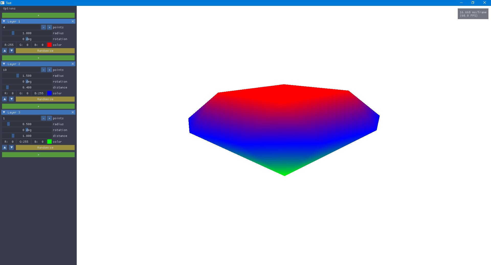

# UTBM_IN55_ParametricObjectsConstruction

## Information

### School project

- University: [UTBM](http://www.utbm.fr/)
- Unit value: IN55 (Image synthesis)
- Semester: Spring 2018

### Authors / students

- [Julien Barbier](https://github.com/beta-ray70)
- [Jérôme Boulmier](https://github.com/Lomadriel)
- [Maxime Pinard](https://github.com/pinam45)

### Subject

Construction and render of a 3D parametric object with OpenGL.

## Preview

## Dependencies

 - [Dear ImGui](https://github.com/ocornut/imgui)
 - [GLEW](https://github.com/nigels-com/glew)
 - [GLFW](https://github.com/glfw/glfw)
 - [glm](https://github.com/g-truc/glm/)

Dependencies are embedded with the project except for GLEW and GLFW on GNU/Linux systems where they must be installed by the user.

## Compilation

To build the project you need a C++17 compliant compiler.

A *CMakeLists.txt* is available, see [Running CMake](https://cmake.org/runningcmake/) for more information.

On linux, a common CMake use is:

	$ mkdir build
	$ cd build
	$ cmake ..
	$ make

On Windows, there is batch files available to configure Visual Studio project in the ``ide`` folder.

## Report

The folder **report-fr/** contain the LaTeX sources of the french report and presentation of the project.

## Copyright

This work is under the MIT License

[Read the license file](LICENSE)
